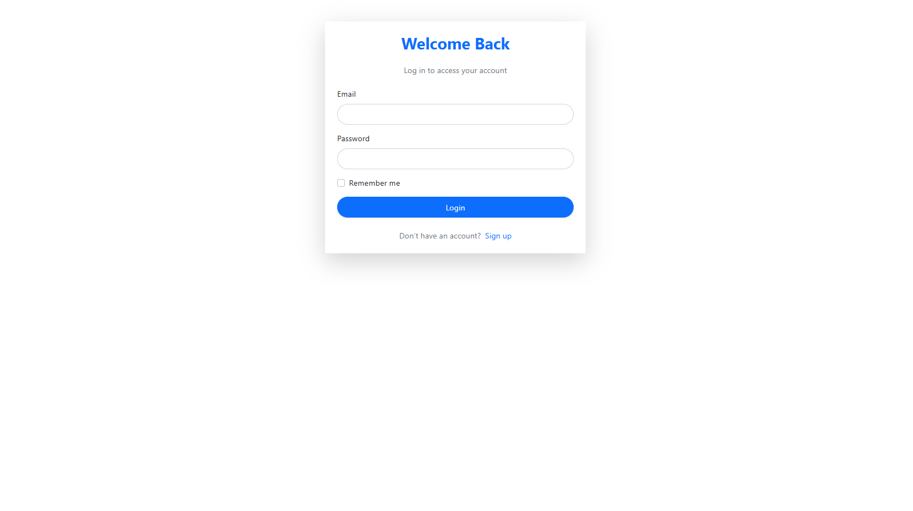
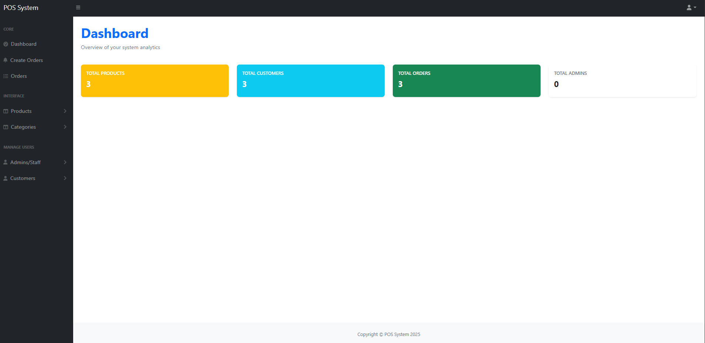

# 🛒 POS System

 <!-- Replace with your actual image path -->

[](https://www.php.net/)
[](https://getbootstrap.com/)
[](https://jquery.com/)
[](LICENSE)

A **simple and lightweight Point of Sale (POS)** application built using **Vanilla PHP**, **MySQL**, **jQuery**, and **Bootstrap**.  
Designed to be easy to install and run locally using **WAMP Server**.  
Includes a basic **authentication system** for secure user login and session management.

---

## 🚀 Features

- **User Authentication**
  - Login / Logout
  - Role-based access (Admin & Customer)

- **CRUD Operations**
  - Products
  - Categories
  - Admin and Staff
  - Orders
  - Customer

- **Sales Transactions**
  - Simple checkout process
  - Order history tracking

- **UI & UX**
  - Responsive design powered by Bootstrap
  - Mobile-friendly interface

- **Database**
  - MySQL-driven
  - Pre-configured sample data for quick setup

---

## 📸 Screenshots

| Login Page                 | Dashboard                  |
|----------------------------|----------------------------|
|  |  |

---

## 📦 Installation

## 🏁 Getting Started

1. **Clone the repository**
    ```bash
    git clone https://github.com/archeangana/POS_SYSTEM_PROJECT.git
    cd pos-system
    ```

2. **Import the Database**
    - A copy of the database SQL file is included in `Http`.
    - Open **phpMyAdmin** (or your preferred MySQL tool).
    - Create a new database (e.g., `pos_db`).
    - Import the SQL file from:
      ```
      Http/pos_db.sql
      ```
    - This will set up all tables and sample data.

3. **Configure Database Connection**
    - Edit your database credentials in the configuration file (usually found in `app/http/database.php`).

4. **Run Locally**
    - Place the project folder inside your WAMP `www` directory.
    - Or if you use XAMPP place the project folder inside your XAMPP `htdocs` directory.
    - Start WAMP and navigate to `http://localhost/pos-system` in your browser.

---

**You're ready to use the POS System!**
